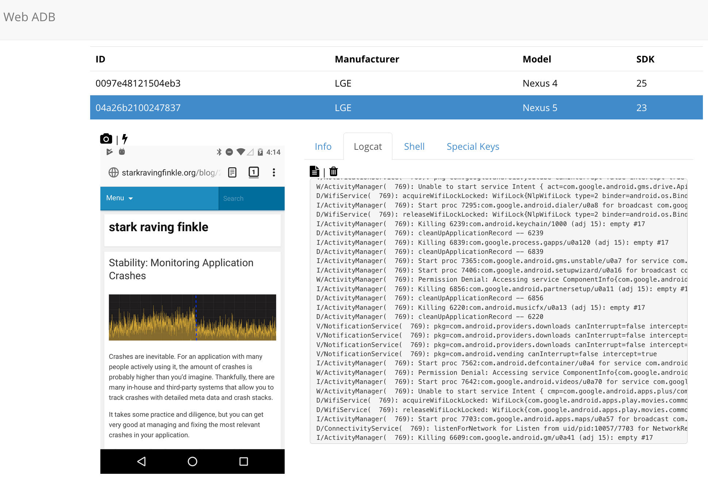

Web ADB
=======
A simple webapp and API for managing and manipulating connected Android devices via the Android Device Bridge (ABD).

## Requirements
The following are required on the host machine running Web ADB:
* Python 2.7
* Android SDK

## Quick Start
* Clone this project to the host machine
* Run `python <path-to-web-adb>/server.py --port=8888 --adb-path=<path-to-android-sdk>/platform-tools/adb`
* Open `http://localhost:8888` in a browser



## Basic Usage
* Connected devices are listed in the table
* Selecting a device will display a panel below the table with more capabilities.
* The action buttons/images have hover text to help you guess what they do.
* Clicking on a screenshot will send a `tap` to the device and refresh the screeshot.

## Details
I tried to keep this as minimal as possible. A single Python file acts as a very simple API server. In addition to several API routes, hiting the root will return a simple single-page webapp.

### Commandline Arguments
* `--port` the local port to bind the server (defaults to `8080`)
* `--adb-path` the path to the `ADB` binary
* `--cert-file` the path to a `PEM` file you want to use to enable `HTTPS` support

### Routes
#### `/` (`GET`, `text/html`)
returns the single-page webapp

#### `/devices` (`GET`, `application/json`)
returns a `JSON` array containing a `JSON` `device` object each connected device
```
[
  {
    "id": "<device-id>",
    "network": {
      "connected": (true|false),
      "ssid": "<wifi-name>"
    },
    "battery": {
      "status": "<range: 1 to 5>",
      "level": "<charge level>",
      "health": "<range: 1 to 7>",
      "plugged": "(USB|AC)"
    },
    "screen": {
      "width": "<XXXpx>",
      "height": "<YYYpx>",
      "density": "<integer density>",
      "orientation": "0|1"
    },
    "model": "<model-name>",
    "manufacturer": "<manufacturer-name>",
    "sdk": "<integer SDK level>"
  },
  {...}
]
```

#### `/screenshot/:device_id` (`GET`, `image/png`)
returns a PNG of the device screen

#### `/logcat/:device_id` (`GET`, `text/plain`)
returns a simple text dump of the logcat

#### `/info/:device_id` (`GET`, `application/json`)
returns a `JSON` `device` object for the given device

#### `/key` (`POST`, `text/plain`): 
executes a keypress on the given device. takes a `JSON` object and returns a plain text status
```
{
  "device": "<device-id>",
  "key": "<key-code>"
}
```

#### `/tap` (`POST`, `text/plain`):
executes a tap on the given device at the given coords. takes a `JSON` object and returns a plain text status
```
{
  "device": "<device-id>",
  "x": "<x-location>",
  "y": "<y-location>"
}
```

#### `/shell` (`POST`, `text/plain`):
executes a shell command on the given device. takes a `JSON` object and returns a plain text status
```
{
  "device": "<device-id>",
  "command": "<shell-command>"
}
```

#### `/reboot` (`POST`, `text/plain`):
reboots the given device. takes a `JSON` object and returns a plain text status
```
{
  "device": "<device-id>"
}
```

## Future Ideas
I threw this project together quickly to scratch a specific itch. Here are some ideas I'd like to think about for the future:
* Heartbeat monitoring to check the device status and connection. Maybe a health ping every 10 seconds.
* Start/Stop monitor for CPU, Network, and Memory usage. Use a simple chart for visualizing it.
* Wrap a few more ADB commands, like pull/push files and APK management.
* Capture video.
* Add swipe support.

## Acknowledgements
Even though I try to minimize dependencies in the server code, I do use some 3rd party libraries in the single-page webapp, pulled in via CDN links:
* JQuery
* Bootstrap
* Handlebars
* Font Awesome